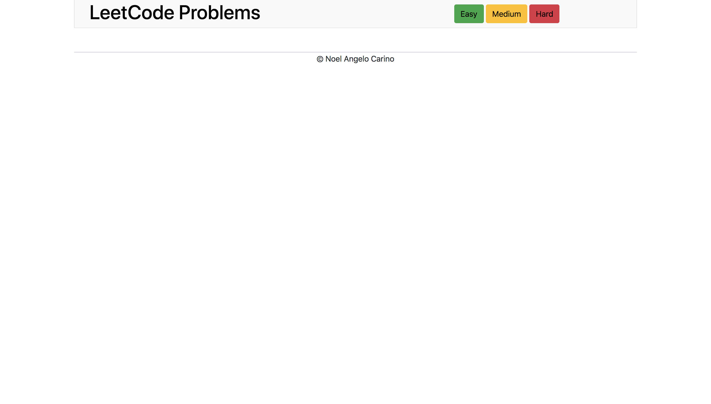

### LeetCode
A repository to keep track of the algorithms I have solved from LeetCode

###  Goals
1. Complete at least 1 Algorithm per day
2. Complete 100 Algorithms Total
3. Keep solving Algorithms until I get a job!
4. Continue to solve algorithms after I get a job!

### Long Term Goal
1. Be able to look at any algorithm and quickly have an understanding of how to solve the algorithm before coding.

